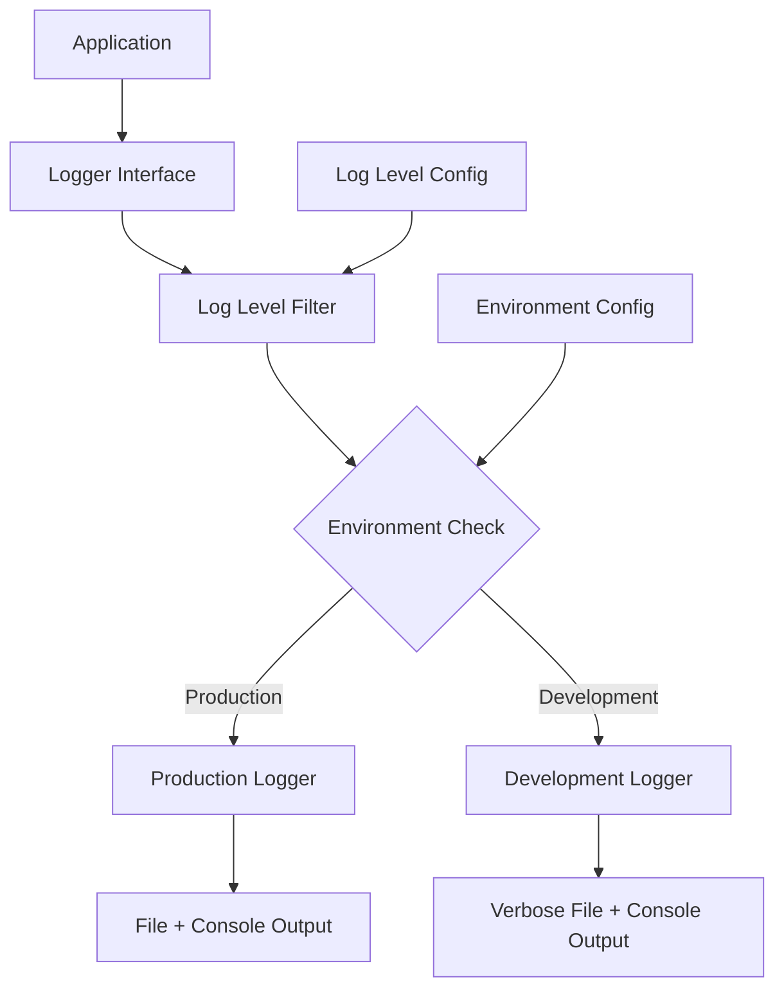

# Design Document

## Overview

The logging optimization design focuses on creating a configurable, performance-oriented logging system that eliminates noise in production while maintaining comprehensive debugging capabilities in development. The solution introduces logging levels, structured logging, and intelligent filtering to address the current issues of excessive log volume and lack of meaningful error tracking.

## Architecture

### Current State Analysis

The current logging system has several issues:
- All log levels (DEBUG, INFO, WARN, ERROR) are active in production
- Excessive logging of routine operations (heartbeats, timer updates, WebSocket messages)
- No centralized logging level management
- Noisy logs that obscure actual problems
- Large log files that impact performance

### Proposed Architecture



## Components and Interfaces

### 1. Enhanced Logger Package

**File: `logger/logger.go`**

The logger package will be enhanced with:
- Configurable log levels based on environment
- Structured logging with context
- Performance-optimized production mode
- Centralized level management

```go
type LogLevel int

const (
    DEBUG LogLevel = iota
    INFO
    WARN
    ERROR
)

type Logger struct {
    level LogLevel
    env   string
    // existing fields...
}

func (l *Logger) SetLevel(level LogLevel)
func (l *Logger) ShouldLog(level LogLevel) bool
func (l *Logger) LogWithContext(level LogLevel, context map[string]interface{}, message string, args ...interface{})
```

### 2. Context-Aware Logging

**Enhanced logging functions:**
- `LogError(context, message, args...)` - Always logged
- `LogWarn(context, message, args...)` - Production + Development
- `LogInfo(context, message, args...)` - Development only (filtered in production)
- `LogDebug(context, message, args...)` - Development only

### 3. Logging Categories

**Production Logging (ERROR + WARN + Critical INFO):**
- Authentication failures
- WebSocket connection errors
- Timer operation failures
- Position occupancy conflicts
- System startup/shutdown
- Critical business logic errors

**Development Logging (All levels):**
- WebSocket message flow
- Timer state changes
- Referee registration events
- HTTP request details
- Debug information

### 4. Environment-Based Configuration

**Configuration Matrix:**

| Environment | DEBUG | INFO | WARN | ERROR |
|-------------|-------|------|------|-------|
| production  | ❌    | ⚠️*   | ✅    | ✅     |
| development | ✅    | ✅    | ✅    | ✅     |
| test        | ❌    | ❌    | ✅    | ✅     |

*Critical INFO only (startup, shutdown, major state changes)

## Data Models

### Log Entry Structure

```go
type LogEntry struct {
    Timestamp   time.Time              `json:"timestamp"`
    Level       string                 `json:"level"`
    Message     string                 `json:"message"`
    Context     map[string]interface{} `json:"context,omitempty"`
    Source      string                 `json:"source"`
    MeetName    string                 `json:"meetName,omitempty"`
    RefereeID   string                 `json:"refereeId,omitempty"`
    Error       string                 `json:"error,omitempty"`
}
```

### Context Categories

**WebSocket Context:**
```go
{
    "component": "websocket",
    "action": "connection_failed",
    "meetName": "Nationals_Platform_1",
    "refereeId": "left",
    "remoteAddr": "192.168.1.100",
    "error": "connection timeout"
}
```

**Timer Context:**
```go
{
    "component": "timer",
    "action": "start_failed",
    "meetName": "Nationals_Platform_1",
    "timerType": "platformReady",
    "timerId": 123,
    "error": "timer already active"
}
```

## Error Handling

### Error Classification

**Critical Errors (Always logged):**
- Database connection failures
- Authentication system failures
- WebSocket server startup failures
- Configuration loading errors

**Operational Errors (Production + Development):**
- Individual WebSocket connection failures
- Timer operation failures
- Position occupancy conflicts
- Invalid referee actions

**Debug Information (Development only):**
- Successful operations
- State transitions
- Performance metrics
- Detailed request/response logging

### Error Context Requirements

All error logs must include:
1. Timestamp with timezone
2. Error level and category
3. Source file and line number
4. Meet context (if applicable)
5. User/referee context (if applicable)
6. Sufficient detail for troubleshooting

## Testing Strategy

### Unit Tests

**Logger Package Tests:**
- Log level filtering functionality
- Environment-based configuration
- Context preservation
- Performance impact measurement

**Integration Tests:**
- End-to-end logging in different environments
- Log file size validation
- Error scenario logging verification

### Performance Tests

**Benchmarks:**
- Logging overhead in production mode
- Memory usage with different log levels
- File I/O performance impact
- Concurrent logging performance

### Test Scenarios

**Production Mode Tests:**
1. Verify DEBUG messages are suppressed
2. Verify routine operations don't generate logs
3. Verify errors are properly logged with context
4. Measure log file size during simulated meet

**Development Mode Tests:**
1. Verify all log levels are active
2. Verify comprehensive debugging information
3. Verify WebSocket message flow logging
4. Verify timer state change logging

## Implementation Strategy

### Phase 1: Core Logger Enhancement
- Implement log level filtering
- Add environment-based configuration
- Create structured logging functions
- Add context support

### Phase 2: Noise Reduction
- Identify and remove noisy log statements
- Replace with conditional logging
- Implement category-based filtering
- Add performance optimizations

### Phase 3: Structured Error Logging
- Enhance error logging with context
- Implement consistent error formats
- Add troubleshooting information
- Create error categorization

### Phase 4: Validation and Optimization
- Performance testing and optimization
- Log file size validation
- Production deployment testing
- Monitoring and alerting setup

## Configuration Management

### Environment Variables

```bash
ENV=production|development|test
LOG_LEVEL=debug|info|warn|error  # Optional override
LOG_FILE_MAX_SIZE=10MB           # Optional file size limit
```

### Default Behavior

- No ENV set → defaults to "production"
- Invalid ENV → falls back to "production"
- No LOG_LEVEL set → uses environment defaults
- Invalid LOG_LEVEL → falls back to environment defaults

## Performance Considerations

### Production Optimizations

1. **Conditional Logging:** Check log level before expensive operations
2. **Lazy Evaluation:** Defer string formatting until needed
3. **Buffer Management:** Optimize file I/O with appropriate buffering
4. **Memory Management:** Minimize allocations in hot paths

### Monitoring

- Log file size monitoring
- Logging performance metrics
- Error rate tracking
- System resource usage during logging

## Documentation Requirements

### Task Implementation Documentation

Each implementation task must generate a detailed markdown documentation file that includes:

**File Location:** `task-{number}-completion-notes.md` in the project root

**Required Content:**
1. **Task Summary:** Brief description of what was implemented
2. **Changes Made:** Detailed list of all code changes, file modifications, and additions
3. **Implementation Details:** Technical explanation of how the solution works
4. **Configuration Changes:** Any new environment variables, settings, or configuration options
5. **Testing Performed:** Description of tests run to validate the implementation
6. **Performance Impact:** Analysis of performance improvements or considerations
7. **Breaking Changes:** Any changes that might affect existing functionality
8. **Usage Examples:** Code examples showing how to use new logging features
9. **Troubleshooting:** Common issues and their solutions
10. **Next Steps:** Any follow-up work or considerations for future tasks

**Documentation Standards:**
- Use clear, technical language appropriate for developers
- Include code snippets with syntax highlighting
- Provide before/after comparisons where applicable
- Document any new APIs or interfaces
- Include performance benchmarks where relevant
- Reference specific requirement numbers that were addressed
